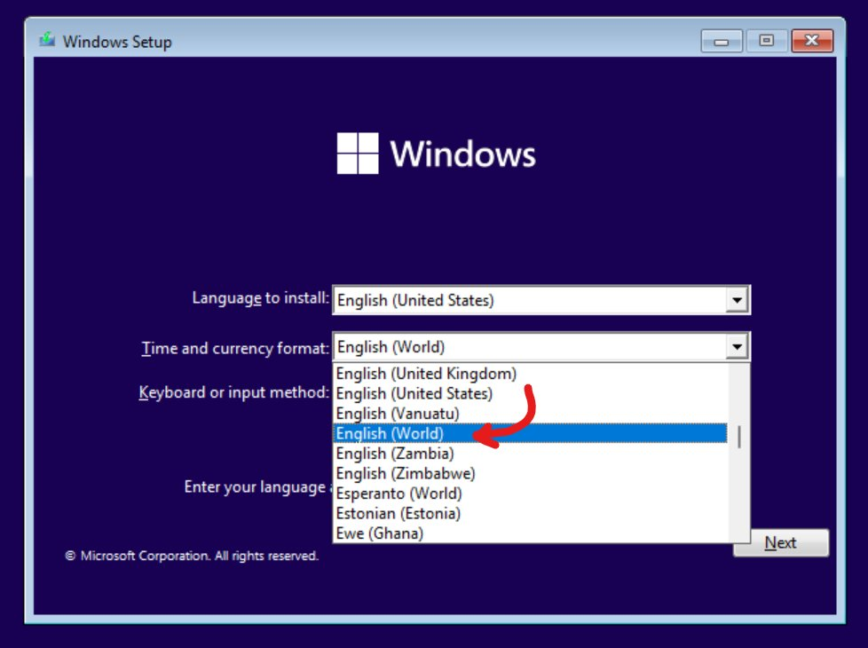
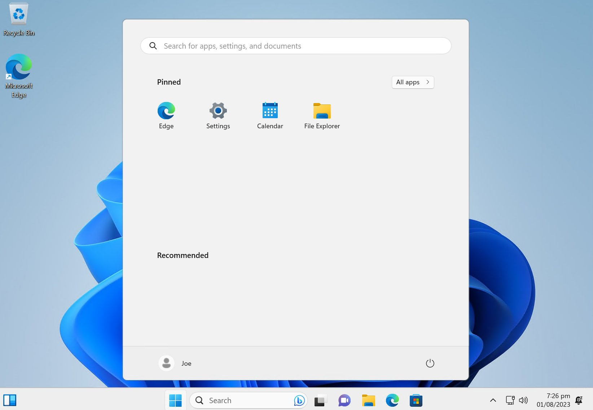

# installing windows

**Here's a simple and straightforward guide on how to get Windows set up.**

There's a bunch of fancy guides on the internet telling you to get a custom windows image (iso) for the best out of the box performance.
They're nice and I tried it out, but I like to tweak everything manually to avoid bad surprises.

> :Download: **Downloading official ISOs**

I only recommend <https://tb.rg-adguard.net>, they generate download links from Microsoft's official website, I used to recommend the mobile trick on Chrome / UUPDump but it was unreliable (corrupted 2 times)

> :mmhtent: **Checking file integrity (SHA1/SHA256)**

It's important to check your ISO's hash to see if it has not been altered, corrupted or maliciously modified

You can find a list of SHA checksums of genuine Windows ISOs here, just find your build with the right language/update: <https://msdn.rg-adguard.net> (if it is down see <http://youtu.be/PY_K6QX3xfk>)

To verify a hash, just open powershell and type `Get-FileHash -Algorithm SHA256 -Path "~\Downloads\W10_21H2.iso"` (of course replace algorithm/file path accordingly

> **Set up a bootable USB drive**

Burn your ISO using rufus: :scoop: `scoop.cmd install extras/rufus` or <https://github.com/pbatard/rufus/releases/latest>

If you have multiple images, you can use Ventoy which allows you to drag and drop ISO files and have a menu to select which image to boot on, note it's compatibility isn't good as Rufus' 
:scoop:`scoop.cmd install extras/ventoy` or <https://github.com/ventoy/Ventoy/releases>

> 🚀 **Booting off the USB**

At first it'll prompt you with a disk manager, wipe your main drive and install your Windows on it, ⚠️  MAKE SURE YOU SELECT THE RIGHT DRIVES/PARTITIONS.

Once you've assigned what drive/partitions to install Windows on, unplug your USB so you don't accidentally boot into the installer again

> :windows: **Installation**

Follow the installation process, not gonna bore you with it because it's pretty intuitive, except these few steps:

At one point you might be stuck because they ask you to make a Microsoft Account in order to continue, to bypass that, unplug your Ethernet cable/Disconnect Wi-Fi and click back, then next.

If you're still not using Scoop check up the handiest post-install tool: #📥｜post-installer

https://streamable.com/0jx4nu

https://github.com/Courage-1984/Discord-Guides/assets/18268669/36487c83-962a-4159-9246-6f73914b89ec

shit made me laugh my ass off, **How to :TrollFace:  the Microsoft log in on Windows 11 OOBE**
:so: Tellinq

https://twitter.com/thiojoe/status/1686565269907636224

> Did you know you can install Windows 11 without any bloatware simply by selecting "English (World)" as the Time & Currency format at the initial install?

