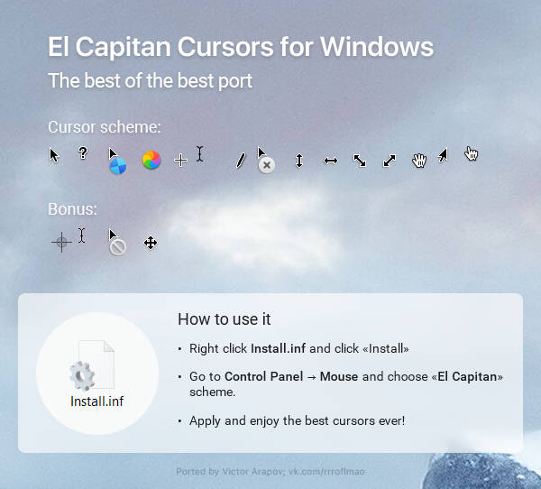

# the cursor vault

Unless you possess rights to the cursor theme:

:dot: You shall not post a direct download link
:dot: A screenshot of the cursors are required, most cursor makers have beautiful pictures regarding them.

_ _

Showcase: https://youtu.be/YThelfB2fvg?t=566

%20[854x480].mp4)

**Find full resolution video [here]()**

Download: http://www.michieldb.nl/other/cursors/

_ _

***Vision Cursor (one of my fav)***

The rounded, minimal and aesthetic cursor, you really can't go wrong with this :D
Download: https://www.deviantart.com/idarques/art/Vision-Cursor-911891424

Once again, extract, right click on .install file and click Install, and click ok to the following prompts.
Want to open the advanced cursor settings? :windows: + R , type main.cpl and then it opens up the menu.

_ _

https://github.com/catppuccin/cursors

_ _

(random osu cursor png with transparent background which i turned into .cur)
(png and cur included)

https://www.deviantart.com/lovelymin/art/osu-Glow-Cursor-Pack-by-Suminoze-867643460
(these are pngs meant to be used for osu! game, I turned the purple ones into .cur using converter website)

_ _

VS Cursor 12.0, my personal favorite <a:CatJAMMER:858748154076725248> 

Link: 
<https://www.deviantart.com/vladsukhetskyi/art/VS-Cursor-12-0-937211931>

_ _

***Windows 11 Tailless cursor*** (in black and white)
Link: https://www.deviantart.com/jepricreations/art/Windows-11-Cursors-Concept-v2-886489356

_ _

https://github.com/phisch/phinger-cursors
released in cc-by-sa-4

_ _

https://winallos.com/kursory/124-pixelfun-3.html

_ _

https://www.deviantart.com/alexgal23/art/Material-x-V-x-Cursors-852805594

_ _

ive been using that for more than a year its really nice

https://www.deviantart.com/proviceunity/art/DotClick-833883041

_ _

https://www.bibata.live

_ _

https://github.com/tholman/cursor-effects

*these are not cursors you import and use but effects for your browser (you can implement it on your site)*

_ _

**macOS Sierra Retina cursors**

https://www.deviantart.com/in-dolly/art/macOS-Sierra-Retina-cursors-650823654

**Updated ElCapitan cursors**

https://www.deviantart.com/in-dolly/art/Updated-ElCapitan-cursors-593804414

`ElCapitan cursors` is smaller but the `macOS Sierra Retina cursors` is much cleaner!

_ _

https://github.com/manu-mannattil/adwaita-cursors

_ _

https://github.com/emvaized/modern_inverted_mouse_cursors

_ _

