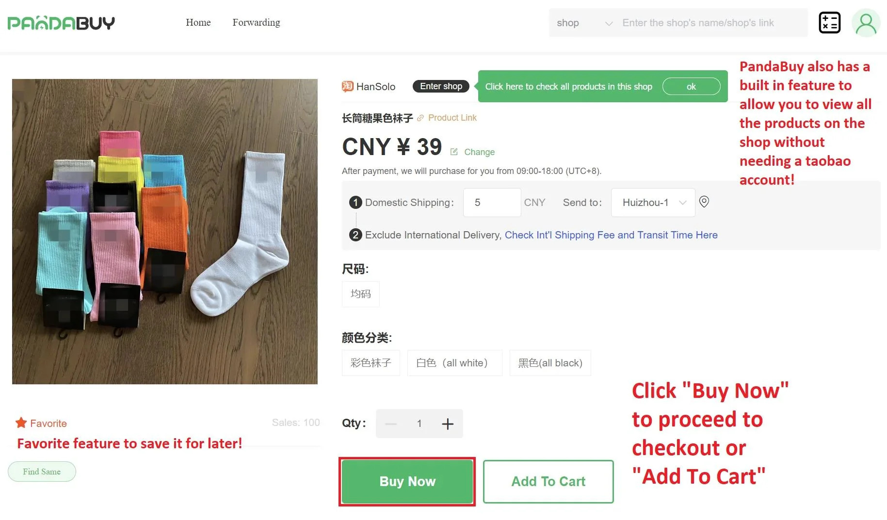

# pandabuy

# **The Full Pandabuy Guide - Buy Expensive For Cheap**

Have you ever wanted to buy a product, whether it's some nice T-Shirt, Shoes, or even jewelry, but then you looked at the product's price tag and didn't realize WTF is that? In that case Pandabuy is exactly what you need!

## **What is Pandabuy?**
Pandabuy is an agent that connects between you and Chinese sellers of Chinese goods, including replicas of clothing, tech, jewelry and more. Replicas are items which look and feel identical to expensive brand items, for cheap, with very high quality!
When ordering products with Pandabuy, the product passes thru Pandabuy's warehouse, where it's quality is getting checked and you will get pictures of the product, if you found a defect or just don't like the product, you can return it!

## **How do I order from Pandabuy?**

### **1. Signing Up & Get Unlimited 5% Shipping Discount**
First of all, you need to sign up to Pandabuy with [this link](https://www.pandabuy.com/login?inviteCode=835LEGX9D), after creating your account successfully you can use the infinite 5% shipping discount code "`nick`".

### **2. How to Find The Product I want?**
There are a couple of ways to find the product you want, you can type it's name in the search bar or search by image, but this way you won't always be satisfied with the product's quality. I recommend the 3rd way, which is looking in online Replica communities. There are a lot of people reviewing the products they bought, so if you like their product, you can copy it's link and paste it in the search bar. In these communities you can also find Spreadsheets which contains a list of recommended products. One more thing in the communities is to ask W2C (Where to Cop) the product you want.

The Communities I recommend are:

r/FashionReps: [Reddit](https://www.reddit.com/r/FashionReps), [Discord](https://discord.gg/fashionreps)

r/Pandabuy: [Reddit](https://www.reddit.com/r/Pandabuy), [Discord](https://discord.gg/pandabuyofficial)

### **3. How to order? (With pictures)**

1. Paste the product link or search

2. Add to cart/buy now:

