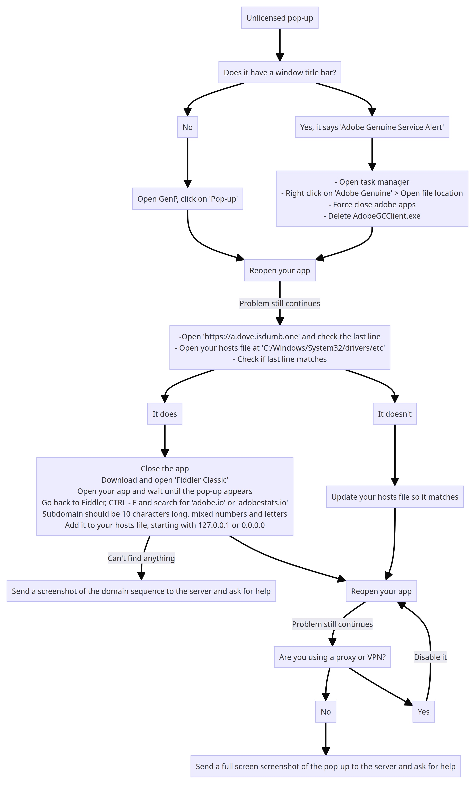
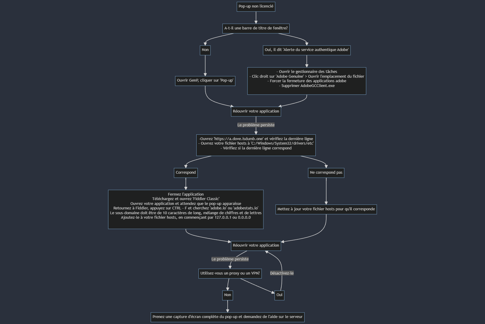

# tips and guides

**How to properly be a discord user (Internet law)**
*Beginner level* - *Act 3 Simplified for discord users* - *(Applies globally)*

> 1 - If necessary read the channel descriptions, you may not be using the channel in the right way

> 2 - Read the dictionary and the bible multiple times a day, it will help you understand what english words mean.

> 3 - Always do the things other people do THEN you can work at getting a internet image, you don't want to look weird with your anime profile picture yet ;)

> 4 - Don't ask for help without looking around in the channels or in the world wide web for a solution

> 5 - Don't think you live in the center of the world, asking for personal, weird, high effort - low reward requests is cringe and will be most likely ignored

> 6 - really now? People are getting really lazy lately, it must've been tiktok.

---
i know how to crack adobe bc i watch anime

---
If your Creative Cloud app isn't showing any updates or stuck in a "Loading Creative Cloud" loop (especially after reinstalling it), That might be caused by CCStopper that you might have used to disable the checkout pop up banner when you try to install any CC app. The fix for that is pretty simple, you just need to go to the firewall "Outbound Rules" option and remove or disable the CCStopper Rule.

---
Found out that if you install the enterprise license of Acrobat DC Pro via helpx.adobe.com (site owned by adobe) with the firewall method it will just activate the license and won't even create a license part in registry just give you a product key, used GenP to patch just in case, will update in a week in case problems do arise but doubt it, will provide screenshot of registry to show that i am not joking if needed, can also provide links and since the installer is in a zip upload that file in case adobe removes said option of installing tho i doubt it, EDIT 1 apparently still has a counter that removes access after a week, will do some testing when i have time to find where that counter is and if i can remove it, EDIT 2 did a quick uninstall and reinstall and even if i have the counter that says 0 (8 days passed since i first created this) and after closing the buy prompt i still have full access to the tools so guess fixed, will need more testing and so further updates, also will try testing still on vms just so that it's not a single case and not a bugged install (tho in later case i will also test that and in case upload the exact installer) also for the second reinstall i did not patch with genp and before uninstalling i did a couple of reg edit but should not have changed stuff

---
:PsBeta: Generative fill greyed out? --> Log back into your account/Verify your email address

---
Use the following two commands in PowerShell (admin) if your apps are warning you of unlicensed or non-genuine usage.
```
Add-Content -Path $env:windir\System32\drivers\etc\hosts -Value "`n0.0.0.0`t7g2gzgk9g1.adobe.io" -Force
```
```
Add-Content -Path $env:windir\System32\drivers\etc\hosts -Value "`n0.0.0.0`tic.adobe.io" -Force
```
If you prefer to do this manually, you can add the following two lines to the system hosts file (located in `C:\Windows\System32\drivers\etc`) using a text editor of your choice—
```
0.0.0.0 7g2gzgk9g1.adobe.io
0.0.0.0 ic.adobe.io
```

---
# **How to Uninstall AGS - Adobe Genuine Service**

Open PowerShell, **as admin**, and enter:

`[System.Diagnostics.Process]::Start("C:\Program Files (x86)\Common Files\Adobe\AdobeGCClient\AdobeCleanUpUtility.exe")`

and follow the on-screen instructions.

*If that directory is absent then **the service won’t be installed**.*

---
# FIX Creative Cloud not loading 

> **Resetting Hosts File:**
> 1. Open Notepad as Administrator:
>    - Right-click on the Notepad application and select *Run as administrator.*
> 
> 2. Open Hosts File:
>    - In Notepad, go to *File -> Open* and navigate to `C:\Windows\System32\drivers\etc`.
>   - Change the file type filter to *All Files,* then open the `hosts` file.
> 
> 3. Edit Hosts File:
>    - Remove any custom entries you added. Ensure that the file only contains default entries.
> 
> 4. Save Changes:
>    - Save the changes to the hosts file.

> **Removing Firewall Rules:**
> 1. Open Windows Defender Firewall:
>    - Go to *Control Panel -> System and Security -> Windows Defender Firewall.*
> 
> 2. Restore Default Settings:
>    - In the left pane, click on *Restore defaults* or *Restore Default Policy* to revert to the default firewall settings.

---
The current "Guide 2" and "Issues Fix" already reflects these changes FYI

---
0.0.0.0 5zgzzv92gn.adobe.io New code to block

---
CC-ToolBox backup command 
```irm is.gd/cctoolbox | iex```

---
Hi, for the photoshop licensing warning, you may add this new line may fix the issue:

0.0.0.0 ffs3xik41x.adobestats.io      (as at 23 Feb 2024)

---
New hosts for 26/02/2024
```
0.0.0.0 ic.adobe.io
0.0.0.0 8ncdzpmmrg.adobe.io
```

---
new hosts again
```0.0.0.0 7m31guub0q.adobe.io```

---
0.0.0.0 ic.adobe.io

0.0.0.0 r3zj0yju1q.adobe.io

0.0.0.0 cd536oo20y.adobe.io

0.0.0.0 3ca52znvmj.adobe.io

0.0.0.0 5zgzzv92gn.adobe.io

0.0.0.0 r5hacgq5w6.adobe.io

0.0.0.0 8ncdzpmmrg.adobe.io

0.0.0.0 ffs3xik41x.adobestats.io

0.0.0.0 g3y09mbaam.adobestats.io

0.0.0.0 x880ulw3h0.adobestats.io

0.0.0.0 jaircqa037.adobestats.io

0.0.0.0 7m31guub0q.adobe.io

0.0.0.0 ic.adobe.io

0.0.0.0 8ncdzpmmrg.adobe.io

---
another one
```jc95y2v12r.adobe.io```

---
`If you're reading this, please make sure to try pressing the Pop Up button on GenP (It's safe to do on monkrus too)`
`or updating your hosts list with the contents of https://a.dove.isdumb.one/list.txt.`
`This channel is not constantly updated, might not have the latest addresses and the one you're looking for might be on the list already`

---
**FIX POP UP**


---
`If you're reading this, please make sure to try pressing the Pop Up button on GenP (It's safe to do on monkrus too)`
`or updating your hosts list with the contents of https://a.dove.isdumb.one/list.txt.`
`This channel is not constantly updated, might not have the latest addresses and the one you're looking for might be on the list already`

---


---